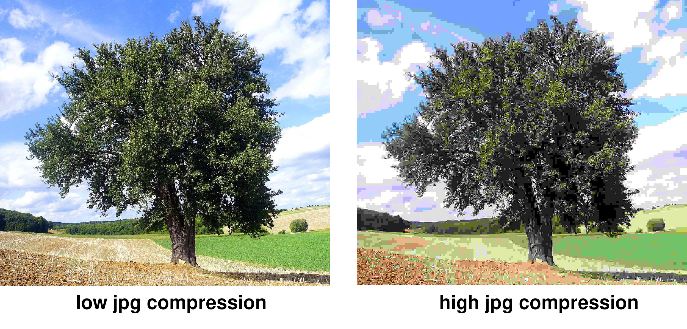
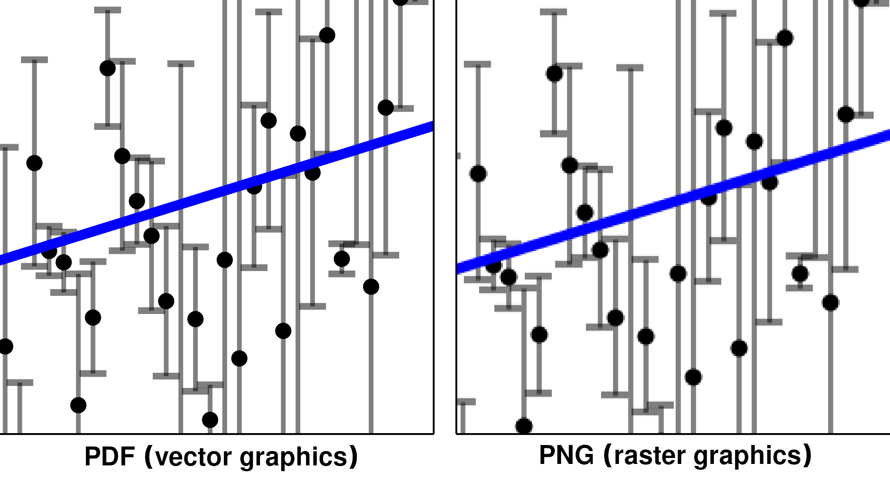
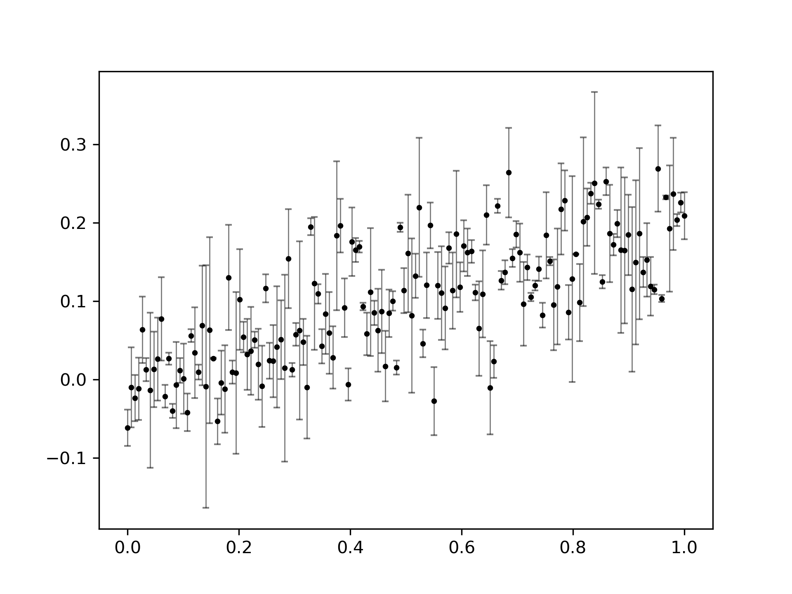
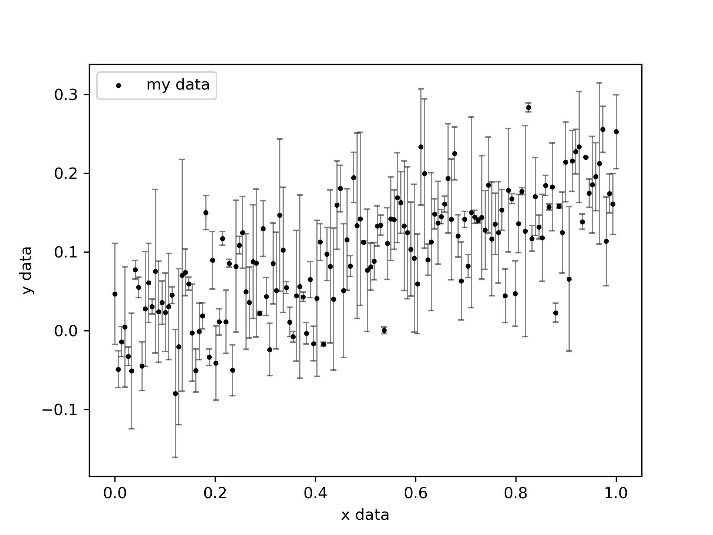
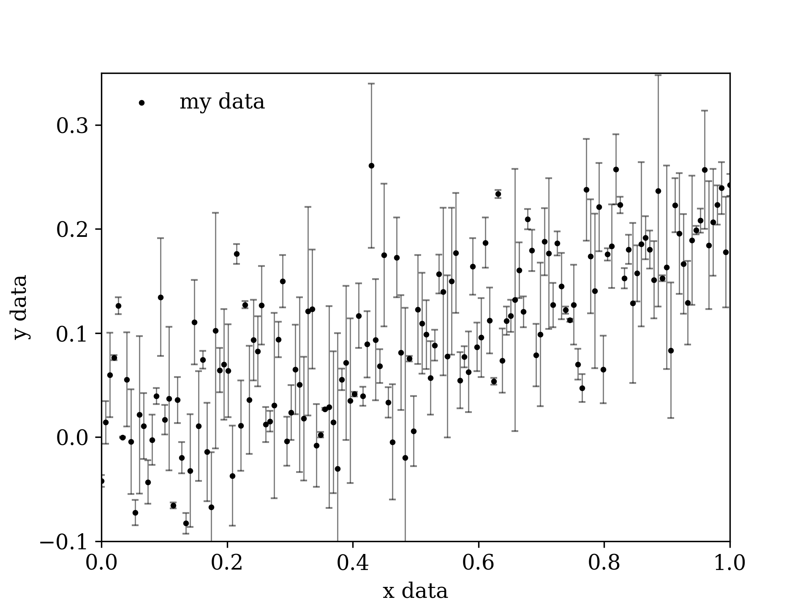

# Intro to Plotting & Matplotlib 

Matplotlib (MPL) is a very useful yet somewhat disorganized collection of technical plotting routines. Their documentation is useful, but it doesn't give you a sense of what types of things are useful for scientific plotting and what options are available to you as you do your analysis. This tutorial is my attempt at organizing and understanding the routines in MPL to expedite the learning process of students new to scientific plotting in python.

This tutorial will also make heavy use of numpy: https://numpy.org/doc/stable/

### Graphics

Before jumping into plotting, let's talk about types of graphics. This is important since different journals will have different rules about the format of your plots. Also, since a lot of analysis revolves around creating and analyzing scientific images, it's important to understand what you are working with.

 Let's start with the most common image type: JPGs are lossy compressed images that don't always retain all of the information you might want. They are also unable to encode transparency, which may be useful in some cases. This is an extreme example, but this type of lossy compression is always being done to JPG images.



PNGs are also common. These are lossless compressed images with a transparency channel. They will retain the image information exactly as rendered (hence lossless), but are limited by resolution. Both PNGs and JPGs are known as "raster graphics" which store information in a dot matrix data structure, which essentially means their pixels are hard-coded to the file and cannot be changed without altering the file itself. 

An alternative to raster graphics is vector graphics. Instead of storing a matrix of colored pixels, vector graphics store both points and curves that are used to render the image, meaning they can be scaled to any size without downgrading the image quality. This is ideal for scientific plotting as the exact location of points and lines on a plot will be independent of screen resolution, and often times scientific plots contain many details that will be lost upon zooming in on a figure if it is saved as a raster graphic. This is why many journals require submissions with figures in vector graphic format, such as PDF or EPS. 



Notice how, despite the high zoom level, the PDF image produces smooth lines, while the PNG, even with a high DPI (dots per inch), produces a pixelated image. This is why it's good practice to produce PDF (or other vector graphic formats such as SVG or EPS) images for publication. When I'm producing images for analysis and pre-publication work, I usually choose to save them as mid to low resolution PNGs to save storage space. If I think a plot might be included in a publication, I always save a PDF version. 

### Pyplot

Pyplot (plt) is the generalized plotting framework of MPL. It contains many but not all of the routines that you will use. It is possible to use plt methods* to do most of your analysis, but this will limit your options. I will begin by showing a few different simple plots using plt to introducing plotting basics, then we will move to a more object-oriented approach. 

*When I say methods, I mean them in the code sense:

```python
plt.method_name(<arguments>)
```

### Simple plotting

Let's start by generating a scatter plot with randomized data. 

```python
#this is pyplot - the plotting framework we'll be using. this statement will be in all your scripts
import matplotlib.pyplot as plt

#numpy is a set of numerical tools for python. they are very useful. check out pylab for a cohesive scientific plotting environment under one namespace. I prefer using them separately, so that's what I'll be doing in this tutorial.
import numpy as np

#define the number of points to plot
num = 150

#create equally spaced x-values between 0 and 1
xdata = np.linspace(0,1,num)

#create y-values (divide by 5 to increase concentration of points - this is purely aesthetic)
#these points will simply create a straight line
ydata = xdata/5

#create a normal distribution of offesets from the mean 
yoff = np.random.normal(loc=0,scale=0.05,size=num)
ydata += yoff

#plot the points we've generated
plt.scatter(xdata,ydata,s=5,c='black')

#create a second equivalent distrbution to apply to error bars
yerr = np.random.normal(loc=0,scale=0.05,size=num)
plt.errorbar(xdata,ydata,yerr,lw=0.7,alpha=0.5,linestyle='None',capsize=2,c='black')

#save the figure as png with high resolution
plt.savefig('scatter.png',format='png',dpi=300)

#you can also show it directly
plt.show()
```



You'll notice this is a very bare-bones plot - there are no axes label, legends, units, or anything that would help you interpret what the data is saying. Let's edit the scatter statement to include a label on the data:

```python
plt.scatter(xdata,ydata,s=5,c='k',label='my data')
```

as well as a few statements for creating more labels:

```python
plt.xlabel('x data')
plt.ylabel('y data')
plt.legend()
```

It's generally a good idea to put this and the end of the script, after everything has been plotted, and right before you save or show the figure. Here's the new image:



We can go one step further now and specify a few other things to make the plot look more professional. Let's add a line before plotting anything to specify our font style:

```python
plt.rc('font', family='serif', size=12)
```

We can also specify axis limits and ticks. Let's add these right before we add our labels from before.

```python
plt.xlim(0,1)
plt.ylim(-0.1,0.35)
plt.xticks([0,0.2,0.4,0.6,0.8,1.0])
plt.yticks([-0.1,0,0.1,0.2,0.3])
```



That's looking a lot better, but there's still a few things that look off to me. These are aethestic choices, but they do impact the legibility of plots, so I encourage you to constantly be thinking about how to create more readable plots. Here's a few things I notice:

- tick marks point outwards
- axis numbers and labels are same font size - makes it hard to read
- no minor tick marks
- large white borders

Unfortunately, not all of these things can be taken care of with a plt method. We need to interact with the plot objects directly in order to change these things. Luckily, it gives us a lot more flexibility in creating more complex plots as well. 

### Object-oriented plotting

Matplotlib contains a multitude of different objects & methods for plotting, many of them mostly working behind the scenes. We want to take a few of the most relevant ones and interact with their properties directly. The most useful will be the *figure* and *axis* objects. These objects are accessible via the subplots method:

```
fig, ax = plt.subplots()
```

Now we can interact with the figure, which is the highest level container object for all other objects, and axes, which hold your data, labels, etc. Because these objects are more specific to their function, their methods can also be more detailed, because we know exactly the type of object we're working with. 

Here's the script for the last plot, but updated to the object-oriented framework.

```python
import matplotlib.pyplot as plt
import numpy as np

plt.rc('font', family='serif', size=12)
fig,ax = plt.subplots()

num = 150

xdata = np.linspace(0,1,num)
ydata = xdata/5

yoff = np.random.normal(loc=0,scale=0.05,size=num)
ydata += yoff

ax.scatter(xdata,ydata,s=5,c='k',label='my data')

yerr = np.random.normal(loc=0,scale=0.05,size=num)
ax.errorbar(xdata,ydata,yerr,lw=0.7,alpha=0.5,linestyle="None",capsize=2,c='k')

ax.set_xlim(0,1)
ax.set_ylim(-0.1,0.35)

ax.set_xticks([0,0.2,0.4,0.6,0.8,1.0])
ax.set_yticks([-0.1,0,0.1,0.2,0.3])

ax.set_xlabel('x data')
ax.set_ylabel('y data')
ax.legend(loc='upper left',frameon=False)

plt.savefig('scatter_2.png',format='png',dpi=300)
```

Notice how many of the places that "plt" used to be have been replaced by "ax", along with a slight change in syntax, e.g. "ax.set_ylabel" instead of "plt.ylabel". Because we can interact with these objects directly, we can define functions that set up the plot for us, then pass it to another function that does our computation. The use of this style of programming might not be immediately obvious, but when you're creating many complex plots with different arrangements, but want to keep a consistent styling across them, this will save *tons* of time and headaches. Let's try reorganizing the plot above.

```python
import matplotlib.pyplot as plt
import numpy as np

#function to create the figure and axis objects from matplotlib
#include the line about font styling
#additional configurations can be placed in here as well, as we'll see shortly
def create_figure():
    plt.rc('font', family='serif', size=12)
    fig,ax = plt.subplots()
    return fig, ax

#function to generate the data and plot it
def my_plot():
    fig, ax = create_figure()
    num = 150

    xdata = np.linspace(0,1,num)
    ydata = xdata/5

    yoff = np.random.normal(loc=0,scale=0.05,size=num)
    ydata += yoff

    ax.scatter(xdata,ydata,s=5,c='k',label='my data')

    yerr = np.random.normal(loc=0,scale=0.05,size=num)
    ax.errorbar(xdata,ydata,yerr,lw=0.7,alpha=0.5,linestyle="None",capsize=2,c='k')

    ax.set_xlim(0,1)
    ax.set_ylim(-0.1,0.35)

    ax.set_xticks([0,0.2,0.4,0.6,0.8,1.0])
    ax.set_yticks([-0.1,0,0.1,0.2,0.3])

    ax.set_xlabel('x data')
    ax.set_ylabel('y data')
    ax.legend(loc='upper left',frameon=False)

    plt.savefig('scatter_2.png',format='png',dpi=300)

#now we have to call the function in order to plot it
my_plot()   
    
```

### Plot Styling

Creating visually appealing plots may seem trivial to us as scientists ("just let the data speak for itself!") but data visualization is a huge component of science communication and outreach. It's also increasingly important in industry, as you will be expected to create reports that are easily digestible by non-scientists. There are many modern code packages that will take care of this for you, but for academic journals, the vanilla matplotlib should work just fine.

Remember, the goal of plotting is to make the point you are trying to convey obvious to your readers. Here are a couple of things to keep in mind when styling your plots to help achieve that goal:

- are your different data fields easily distinguishable?
- is your data clearly labeled with a legend?
- is that legend easily visible or obscuring any data?
- are your axes clearly labeled and contain units?
- are the tick labels spaced out enough?
- are the ticks useful for determining values within the plot?
- is the font large enough to read?
- are the axis limits sufficient to fit all your data comfortably in the plotting window?
- is there any dead space in the plot?

You may have to spend a bit of time tweaking the plotting configuration to get it to look good. But be careful, it's easy to get lost with this! Don't let perfect be the enemy of good, but also don't let your plots be sloppy and unprofessional. It's definitely a balancing act.

For generating plots, plt.subplots() is the main function to generate the figure and (sub)plots you'll need to hold your data. Here are a few useful arguments:

- nrows - int - number of horizontal rows of subplots

- ncols - int - number of vertical columns of subplots

- sharex - bool - make your subplots share x-axis properties

- sharey - bool - make your subplots share y-axis properties

- figsize - tuple - (x,y) dimensions of your figure in inches

- gridspec_kw - a dictionary object that contains addition properties

  - example:

  - ```python
    plt.subplots(2,gridspec_kw = {'height_ratios':[2, 1]})
    ```

  - this create 2 subplots where the first is twice as tall as the second. this is by far the most common property I edit with this argument, but there are many others

If you have multiple subplots, these will be output in an array. For this reason, if plotting more than a single subplot, I use "axarr" to represent the array of axis objects representing each subplot. E.g:

```python
fig, axarr = plt.subplots(nrows=1, ncols=4, sharey='row', figsize=(figx,figy)) 
```

This creates four equally sized horizontally-oriented subplots that share y-axis properties.

You can change the amount of whitespace between subplots with the following:

```python
fig.subplots_adjust(wspace=0);fig.subplots_adjust(hspace=0)
```

Additionally, use ax.tick_params() to adjust properties of your tick marks. Useful arguments:

- axis - 'x', 'y', or 'both' - which axis would you like to adjust?
- which - 'major', 'minor', or 'both' - which style of tick mark would you like to adjust? the main difference is that major ticks have labels for their values, while minor do not. 
- top/bottom/left/right - bool - which side of the plot do you want to have these ticks on?
- labeltop/labelbottom/labelleft/labelright - bool - do you want to include tick labels here?
- direction - 'in', 'out'
- labelsize - int - how large should the tick labels be
- length - int - how long should these ticks be?

The following two lines of code create ticks on all sides of the plot, with labels only on the left and right, with larger major ticks than minor ticks:

```python
#set all ticks to be the same, with desired properties
ax.tick_params(axis='both', which='both', top=True, bottom=True, left=True, right=True, labeltop=False, labelbottom=True,  labelleft=True, labelright=False, direction='in', labelsize=12, length=3)
#now make just the major ticks a bit larger
ax.tick_params(axis='both',which='major',length=6)
```

A couple other bits of code that may be useful:

```python
#trim the whitespace around the edges of the plot
plt.rcParams.update({'savefig.bbox': 'tight', 'savefig.pad_inches':'0.05'})

#use a dark background
plt.style.use('dark_background')

#make a text annotation (useful for labeling data)
#include xycoords='axes fraction' to use relative coordinates
#omit it to use absolute coordinates
#use ha='right'/'left'/'center' to specify horizontal orientation
text = ax.annotate('text',xy=(0.5,0.5),color='black',size=12)

#create an outline around your text (or whatever else) to make it more visible
import matplotlib.patheffects as path_effects
text.set_path_effects([path_effects.PathPatchEffect(linewidth=2, facecolor='black', edgecolor='white'), path_effects.Normal()])	
```

You may also want to include latex-style markup to create math expressions in your strings. Simply place the character "r" before a string to do this. For example:

```python
ax.set_xlabel(r"$v_\mathregular{max}$ [km s$^{-1}$]")
```


### Colormaps & Colorbars

Colormaps are a great way to either get consistent coloration throughout a set of plots, or to show another field of data through color.

To create an array of color values that you can assign to data fields, simply include the following:

```python
n = 10 #or whatever number of data sets you want to use
colors = plt.cm.jet(np.linspace(0,1,n))
```

There! Now you have an array of 10 evenly spaced colors within the "jet" colormap. To find other colormaps, go to https://matplotlib.org/3.2.1/gallery/color/colormap_reference.html

A simple way to get a colorbar for a third data set is the following:

```python
cm = plt.cm.get_cmap('RdYlBu')
xy = np.arange(20)
z = xy
sc = plt.scatter(xy, xy, c=z, vmin=0, vmax=20, s=35, cmap=cm)
plt.colorbar(sc)
plt.show()
```

Here, the colorbar is generated based on the data you plot, and is tied to the styling of the plot. vmin & vmax define the limits of the data represented by the colorbar, and c defines the data used to create the colorbar. This method has it's limitations, especially if you don't necessarily know z for every data point in advance.

I have found that the best way to plot a third data set as colors on your plot is to create a colormap using an external array, so it doesn't automatically inherit unwanted properties from your plot, such as alpha (transparency), or that it doesn't get under-sampled.

To do this, we should have a general idea of the range our data is going to take in advance. We then create an array to serve as the source of our colorbar, from which we will pull values to color individual points. 

```python
import matplotlib.colors as mplcolors
#create parameter-space for colormap to sample
c = np.linspace(4,9,1000)
norm = mplcolors.Normalize(vmin=c.min(), vmax=c.max())
cmap = cm.ScalarMappable(norm=norm, cmap=cm.plasma)
cmap.set_array([])
```

Now, whenever we plot a line or a point, we can use a piece of data that describes it to map to a color from the colormap we created above:

```python
import math_helper as m
ax.plot(x,y,lw=1,c=cmap.to_rgba(m.find_nearest(c,z)))
```

Here, we used m.find_nearest() to get a value from the "c" array we created before that best matches the property "z" that we're using to color the point.

Lastly, we have to create the colorbar so that it shows up on our figure by including

```python
cbar = fig.colorbar(cmap,label='property z')
```

The "colorbar" method can take a few different arguments to customize it:

- orientation - 'horizontal'/'vertical'

- ticks - array - locations of tick marks on the colorbar

- anchor - tuple - (x,y) relative position to which the colorbar is anchored

- ax - axis object - the axis to which this colorbar is bound

  - if you have subplots and want to include a colorbar that applies to all subplots simultaneously, use 

  - ```python
    fig.colorbar(cmap,ax=axarr.ravel().tolist())
    ```

Change where the tick marks and label go by including

```python
cbar.ax.xaxis.set_ticks_position('top')
cbar.ax.xaxis.set_label_position('top')
```

Substitute "xaxis" for "yaxis" if using a vertical colorbar.

# Creating Your Plotting Environment

### Organized Scripting

Creating scripts that have particular functions is key to an organized coding environment. If you lump everything together, it will be difficult to keep track of all the different things going on within a particular script even when using functions. On the other hand, it's difficult to keep track of a hundred different scripts that each have a highly specific function. This is why we'll develop "modules" that have a specific, yet broad enough function to streamline our code. For example, above we defined a function called "create_figure()". What if we want to have many possible types of figures readily available to us? For this, I use a script that I call "plot_helper.py" that contains all of the plotting routines I need. I can then import that into my main script "plotting.py" and not worry about the nitty gritty of creating the perfect plot every time. Once and done!

I'll share a simplified version of my plot_helper.py script here.

```python
import numpy as np 
import matplotlib.pyplot as plt 
from datetime import datetime
import os,sys,inspect

#custom constants
s=16 				# regular font size,
ls=18				# label font size
lw=2.5  			# line width
ms=7				# marker size
gs=11				# legend font size
aph=0.7 			# alpha
ntl=3				# minor tick length
jtl=6				# major tick length
ts=11				# overlay text size
ra=-90				# text rotation angle
ms=4.5				# marker size
grey = '#727d8e' 	# the color grey

#function to make a figure with specified panel configuration
#you can continue to add elif blocks with new panel configurations as they are needed
def makefig(n_panels=1,height=2.5,figx=6,figy=6):
	if n_panels==1:
		fig, ax = plt.subplots(figsize=(figx,figy))
		plt.rc('font', family='serif', size=s)
		ax.tick_params(axis='both', which='both', top=True, bottom=True, labelbottom=True, labeltop=False,
				left=True, right=True, labelleft=True, labelright=False, direction='in',labelsize=s,
				length=ntl)
		ax.tick_params(axis='both',which='major',length=jtl)
		return fig, ax

	elif n_panels=='2_horiz':
		fig, axarr = plt.subplots(nrows=1, ncols=2, sharey=True, figsize=(figx,figy)) 
		fig.subplots_adjust(wspace=0);fig.subplots_adjust(hspace=0)
		plt.rc('font', family='serif',size=s)

		axarr[0].tick_params(axis='both', which='both', top=True, bottom=True, labelbottom=True, labeltop=False,
			left=True, right=True, labelleft=True, labelright=False, direction='in',labelsize=s,length=ntl)
		axarr[1].tick_params(axis='both', which='both', top=True, bottom=True, labelbottom=True, labeltop=False,
			left=False, right=True, labelleft=True, labelright=False, direction='in',labelsize=s,length=ntl)
		axarr[0].tick_params(axis='both',which='major',length=jtl)
		axarr[1].tick_params(axis='both',which='major',length=jtl)
		return fig, axarr

	elif n_panels=='2_vert':
		fig, axarr = plt.subplots(2, sharex=True, gridspec_kw = {'height_ratios':[height, 1]},figsize=(figx,figy)) 
		fig.subplots_adjust(wspace=0);fig.subplots_adjust(hspace=0)
		plt.rc('font', family='serif',size=s)

		axarr[0].tick_params(axis='both', which='both', top=True, bottom=True, labelbottom=False, labeltop=False,
			left=True, right=True, labelleft=True, labelright=False, direction='in',labelsize=s,length=ntl)
		axarr[1].tick_params(axis='both', which='both', top=True, bottom=True, labelbottom=True, labeltop=False,
			left=True, right=True, labelleft=True, labelright=False, direction='in',labelsize=s,length=ntl)
		axarr[0].tick_params(axis='both',which='major',length=jtl)
		axarr[1].tick_params(axis='both',which='major',length=jtl)
		return fig, axarr
#function to manually clear a given axis object since sometimes matplotlib doesn't override the default tick labels
def clear_axes(ax):
	from matplotlib.ticker import StrMethodFormatter, NullFormatter
	ax.yaxis.set_major_formatter(StrMethodFormatter('{x:.0f}'))
	ax.yaxis.set_minor_formatter(NullFormatter())
	ax.xaxis.set_major_formatter(StrMethodFormatter('{x:.0f}'))
	ax.xaxis.set_minor_formatter(NullFormatter())
```

We can now use this script to create different kinds of plots automatically whenever we need them. Just import this file into your plotting script to use make_fig(). I store my utility scripts in a separate folder. If you would like to do this, simply add the directory to your PYTHONPATH variable in your .bashrc with the following line:

```bash
export PYTHONPATH="${PYTHONPATH}:/path/to/your/utilities/folder/"
```

The path should directly contain the .py files and not be a parent folder.

Personally, I also have helper scripts for common math stuff, some common directories I use (particularly useful when you have multiple machines or clusters to work on), as well as more in-depth calculations that I keep separate from my plotting functions. Here are a couple math things that might be useful:

```python
#find the value within a given array that is closest to a specified value. if getindex = False, it returns the value, otherwise the index in the array where the value exists
#useful for resampling, or mapping data to a predefined colormap
def find_nearest(array, value, getindex=False):
    array = np.asarray(array)
    idx = (np.abs(array - value)).argmin()
    if getindex: return idx
    else: return array[idx]

#create scientific notation for a number with the specified number of digits - useful for looking at particularly large or small numbers
def scinote(n,digits=3):	
	if (n >= 0): n_sign = ''
	elif (n < 0): n_sign = '-'
	n = np.abs(n)

	if (np.log10(n) >= 0):
		return n_sign+str(np.round(10**(np.log10(n) % 1), digits))+'e'+str(np.int(np.log10(n)))
	elif (np.log10(n) < 0):
		return n_sign+str(np.round(10**(np.log10(n) % 1), digits))+'e'+str(np.int(np.log10(n))-1)


	elif n==np.nan: return 'nan'
	elif n==np.inf: return 'inf'
	elif n==-np.inf: return '-inf'
	elif n==0: return '0'
	else: raise ValueError('unknown format: '+str(n)+' '+str(type(n)))
```

### Exception Handling

This reminds me of a good practice that I don't see scientists using nearly enough as they should: exception handling. Use "raise ValueError('string')" add/or try-except blocks to keep your code working well and handle bugs with grace and clarity!

A generic example of exception handling:

```python
try:
	do.a_thing()
except:
	if condition:
		do.another_thing()
	else:
		raise ValueError("the thing did not work")
```

### Configure Your Python

Other was you can configure your python environment are ~/.matplotlib/matplotlibrc along with ipython profiles. Ipython is an interactive python terminal. I often use it to test code before including it in the full plotting function. You can create a profile with

```python
ipython profile create
```

This will create a directory "~/.ipython/profile_default" where you will find a file called "ipython_config.py". There you can do all sorts of cool stuff, but mainly I include common import statements. For example:

```python
c.InteractiveShellApp.exec_lines = ['import numpy as np','import matplotlib.pyplot as plt']
```

